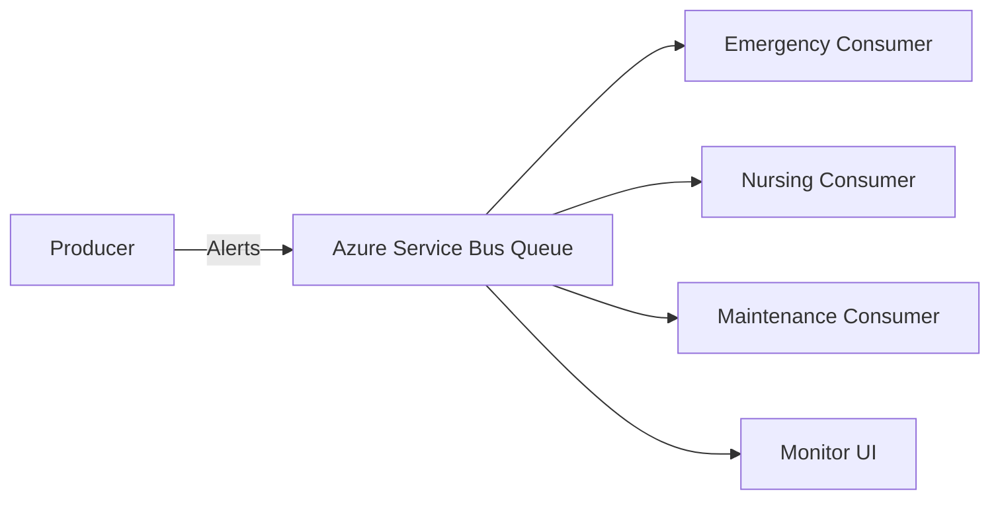

# 🏥 Hospital Alert System

<div align="center">


A modern, real-time hospital alert management system powered by Azure Service Bus 🚀

</div>

## 📋 Table of Contents
- [Overview](#-overview)
- [Architecture](#-architecture)
- [Prerequisites](#-prerequisites)
- [Azure Setup](#-azure-setup)
- [Installation](#-installation)
- [Running the Project](#-running-the-project)
- [Project Structure](#-project-structure)
- [Developer](#-developer)
- [License](#-license)


## 🗂️ Project Structure
```
HospitalAlertSystem/
├── Domain/
│ ├── AlertEvent.cs // Shared data model
│ └── Constants.cs // Shared constants (exchanges, queues, routing keys)
├── Producer/
│ ├── Program.cs // Produces 3 types of alerts
│ └── Producer.csproj
├── Consumers/
│ ├── EmergenciaConsumer/
│ │ ├── Program.cs
│ │ └── EmergenciaConsumer.csproj
│ ├── EnfermeriaConsumer/
│ │ ├── Program.cs
│ │ └── EnfermeriaConsumer.csproj
│ └── MantenimientoConsumer/
│ ├── Program.cs
│ └── MantenimientoConsumer.csproj
├── AlertMonitorUI/
│ ├── Form1.cs // Windows Forms consumer alert UI
│ └── AlertMonitorUI.csproj
└── HospitalAlertSystem.sln // Visual Studio Solution file
```

---


## 🔍 Overview
This system provides real-time hospital alert management using Azure Service Bus for reliable message queuing and processing. It handles various types of hospital alerts including emergency, nursing, and maintenance notifications.

## 🏗️ Architecture


## 🛠️ Prerequisites
- **Azure Account** with active subscription
- **.NET 7.0 SDK**
- **Visual Studio 2022** or **VS Code**
- **Node.js** (LTS version)
- **npm** or **yarn**

## ☁️ Azure Setup
1. Create an Azure Service Bus namespace in [Azure Portal](https://portal.azure.com)
2. Create a queue named `alerts`
3. Get your connection string:
   - Go to Azure Portal → Service Bus Namespace
   - Select "Shared access policies"
   - Click on "RootManageSharedAccessKey"
   - Copy the "Primary Connection String"

## 📥 Installation

1. **Clone the repository**
```powershell
git clone https://github.com/your-username/hospital-alert-system.git
cd hospital-alert-system
```

2. **Update Azure Connection String**
Replace the "XXXXX" placeholder in these locations:
- `HospitalAlertUI/Services/ServiceBusListener.cs`
- `Producer/Program.cs`

With your Azure Service Bus connection string.

## 🚀 Running the Project

You'll need to open multiple terminals to run all the services. Each command below should be run in a new terminal:

1. **Start the Consumers** (3 terminals needed):

Terminal 1 - Emergency Consumer:
```powershell
dotnet run --project Consumers/EmergenciaConsumer/EmergenciaConsumer.csproj
```

Terminal 2 - Nursing Consumer:
```powershell
dotnet run --project Consumers/EnfermeriaConsumer/EnfermeriaConsumer.csproj
```

Terminal 3 - Maintenance Consumer:
```powershell
dotnet run --project Consumers/MantenimientoConsumer/MantenimientoConsumer.csproj
```

2. **Start the Producer** (new terminal):
```powershell
dotnet run --project Producer/Producer.csproj
```

3. **Launch the UI** (2 terminals needed):

Terminal 5 - Backend Server:
```powershell
cd server
npm install
npm run dev
```

Terminal 6 - Frontend:
```powershell
npm install
npm run dev
```

Total terminals needed: 6 (3 for consumers, 1 for producer, 2 for UI)

## 📂 Project Structure
- `Producer/`: Alert generation service
- `Consumers/`: Alert processing services
  - `EmergenciaConsumer/`: Emergency alerts handler
  - `EnfermeriaConsumer/`: Nursing alerts handler
  - `MantenimientoConsumer/`: Maintenance alerts handler
- `HospitalAlertUI/`: Blazor-based web interface
- `Domain/`: Shared models and constants
- `AlertMonitorUI/`: Desktop monitoring application

## 👨‍💻 Developer
<div align="center">
  <strong>Jhoel Suarez</strong>
  <br>
  Software Developer
  <br>
  
</div>

## 📄 License
This project is licensed under the MIT License - see the [LICENSE](LICENSE) file for details.

---
<div align="center">
  Made with ❤️ using Azure Service Bus and .NET
</div>


